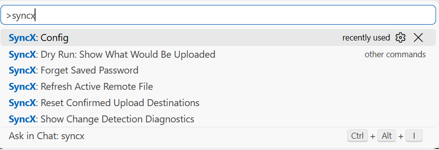

# VSCode-SFTP

Configurations are stored in your project working directory under `../.vscode/sftp.json`. <br>
The configuration file can always be accessed with `CTRL` + `Shift` + `P`, and searching for `SyncX: Config`.



## Table of Contents

### Configuration
- [name](#name)
- [context](#context)
- [protocol](#protocol)
- [profiles](#profiles)
- [defaultProfile](#defaultprofile)
- [remote](#remote)
- [host](#host)
- [port](#port)
- [username](#username)
- [password](#password)
- [remotePath](#remotepath)
- [filePerm](#fileperm)
- [dirPerm](#dirperm)
- [uploadOnSave](#uploadonsave)
- [useTempFile](#usetempfile)
- [openSsh](#openssh)
- [downloadOnOpen](#downloadonopen)
- [syncOption](#syncoption)
- [ignore](#ignore)
- [ignoreFile](#ignorefile)
- [watcher](#watcher)
- [remoteTimeOffsetInHours](#remotetimeoffsetinhours)
- [remoteExplorer](#remoteexplorer)
- [concurrency](#concurrency)
- [connectTimeout](#connecttimeout)
- [limitOpenFilesOnRemote](#limitopenfilesonremote)

### SFTP only configuration
- [hop](#hop)
- [agent](#agent)
- [privateKeyPath](#privatekeypath)
- [passphrase](#passphrase)
- [interactiveAuth](#interactiveauth)
- [algorithms](#algorithms)
- [sshConfigPath](#sshconfigpath)
- [sshCustomParams](#sshcustomparams)

### FTP(s) only configuration
- [secure](#secure)
- [secureOptions](#secureoptions)
- [passive](#passive)
- [encoding](#encoding)


## Configuration

### name
A string to identify your configuration.

| Key | Value |
| --- | --- |
| *name* | *string* |

```json
{
  "name": "My Server"
}
```

### context
A path relative to the workspace root folder. <br>
Use this when you want to map a subfolder to the `remotePath`.

| Key | Value | Default |
| --- | --- | --- |
| *context* | *string* | *The workspace root.* |

```json
{
  "context": "/_subfolder_"
}
```

### protocol
Protocol to be used.

| Key | Value | Default |
| --- | --- | --- |
| *protocol* | `sftp` *or* `ftp` | `sftp` |

```json
{
  "protocol": "sftp"
}
```

### profiles
Several servers for one folder. Each profile is a configuration of its own, merged over the top level, so only the differences need repeating.

A profile can override anything, `watcher` and `ignore` included. Switch between them with **SyncX: Set Profile**; the watcher restarts with the settings of the profile you switched to. Change detection keeps its state per profile, because one file legitimately differs from one server and matches another.

| Key | Value | Default |
| --- | --- | --- |
| *profiles* | *object* | |

```json
{
  "host": "staging.example.com",
  "username": "deploy",
  "remotePath": "/srv/staging",
  "profiles": {
    "staging": { "host": "staging.example.com", "remotePath": "/srv/staging" },
    "production": { "host": "example.com", "remotePath": "/srv/www", "uploadOnSave": false }
  }
}
```

### defaultProfile
Which profile is active when a window opens.

| Key | Value | Default |
| --- | --- | --- |
| *defaultProfile* | *string* | |

```json
{
  "defaultProfile": "staging"
}
```

### remote
Take the connection details from a named remote in your **user settings** instead of from this file, so that nothing about the server is committed with the project.

Define the remotes once, in VS Code's settings under `remotefs.remote`:

```json
{
  "remotefs.remote": {
    "my-server": {
      "scheme": "sftp",
      "host": "example.com",
      "port": 22,
      "username": "deploy",
      "privateKeyPath": "~/.ssh/id_ed25519"
    }
  }
}
```

Then name one in `.vscode/sftp.json`, and give only what is specific to this project:

```json
{
  "remote": "my-server",
  "remotePath": "/srv/www/project",
  "uploadOnSave": true
}
```

Anything set in this file wins over what the named remote provides. `scheme` in the remote means `protocol` here, and `rootPath` is ignored -- use `remotePath`.

| Key | Value | Default |
| --- | --- | --- |
| *remote* | *string* | |

### host
Hostname or IP address of the server.

| Key | Value |
| --- | --- |
| *host* | *string* |

```json
{
  "host": "server.example.com"
}
```

### port
Port number of the server.

| Key | Value |
| --- | --- |
| *port* | *integer* |

```json
{
  "port": 22
}
```

### username
Username for authentication.

| Key | Value |
| --- | --- |
| *username* | *string* |

```json
{
  "username": "user1"
}
```

### password
[!WARNING]
**Passwords are stored as plain-text!**

The password for password-based user authentication.

| Key | Value |
| --- | --- |
| *password* | *string* |

```json
{
  "password": "Password123"
}
```

### remotePath
The absolute path on the remote host.

| Key | Value | Default |
| --- | --- | --- |
| *remotePath* | *string* | `./` |

```json
{
  "remotePath": "/_subfolder_"
}
```

### filePerm
Set octal file permissions for new files.

| Key | Value | Default |
| --- | --- | --- |
| *filePerm* | *number* | `false` |

```json
{
  "filePerm": 644
}
```
 
### dirPerm
Set octal directory permissions for new directories.

| Key | Value | Default |
| --- | --- | --- |
| *dirPerm* | *number* | `false` |

```json
{
  "dirPerm": 750
}
```

### uploadOnSave
Upload on every save operation of VSCode.

| Key | Value | Default |
| --- | --- | --- |
| *uploadOnSave* | *boolean* | `false` |

```json
{
  "uploadOnSave": true
}
```

### useTempFile
Upload to a temporary file and rename it into place, rather than writing straight to the target.

Writing directly truncates the target the moment the transfer starts, so a dropped connection leaves a shortened file on the server: the old version is gone and the new one never arrived. With a temporary file the previous version stays intact until the complete one is ready. Anything reading from the server mid-transfer sees one or the other, never a half-written file.

The cost is one extra file in the directory for the duration of the transfer, and one rename. Where the directory does not allow creating one, the transfer falls back to writing directly and says so in the output.

| Key | Value | Default |
| --- | --- | --- |
| *useTempFile* | *boolean* | `true` |

```json
{
  "useTempFile": false
}
```

### openSsh
Enable atomic file uploads (*only supported by openSSH servers*).

| 💡 Important |
| :--- |
| *If set to* `true`*, the* `useTempFile` *option must also be set to* `true`.|

| Key | Value | Default |
| --- | --- | --- |
| *openSsh* | *boolean* | `false` |

```json
{
  "openSsh": true,
  "useTempFile": true
}
```

### downloadOnOpen
Download the file from the remote server whenever it is opened.

| Key | Value | Default |
| --- | --- | --- |
| *downloadOnOpen* | *boolean* | `false` |

```json
{
  "downloadOnOpen": true
}
```

### syncOption
Configure the behavior of the `Sync` command.

| Key | Value | Default |
| --- | --- | --- |
| *syncOption* | *object* | `{}` |

#### syncOption.delete
Delete extraneous files from destination directories.

| Key | Value |
| --- | --- |
| *syncOption.delete* | *boolean* |

#### syncOption.skipCreate
Skip creating new files on the destination.

| Key | Value |
| --- | --- |
| *syncOption.skipCreate* | *boolean* |

#### syncOption.ignoreExisting
Skip updating files that exist on the destination.

| Key | Value |
| --- | --- |
| *syncOption.ignoreExisting* | *boolean* |

#### syncOption.update
Update the destination only if a newer version is on the source filesystem.

| Key | Value |
| --- | --- |
| *syncOption.update* | *boolean* |

```json
{
  "syncOption": {
    "delete": true,
    "skipCreate": false,
    "ignoreExisting": false,
    "update": true
  },
}
```

### ignore
Ignore can be used to ignore files and folders from sync, and even supports wildcards using `*`. <br>
This is the same behavior as gitignore, all paths relative to context of the current configuration.
 
| Key | Value | Default |
| --- | --- | --- |
| *ignore* | *string[]* | `[".vscode", ".git", ".DS_Store"]` |
 
```json
{
  "ignore": [
    "/.vscode",
    "/.git",
    "/.cache",
    "/_subfolder_",
    ".DS_Store",
    "*.gz",
    "*.log"
  ],
}
```

### ignoreFile
Absolute path to the ignore file or Relative path relative to the workspace root folder.
 
| Key | Value |
| --- | --- |
| *ignoreFile* | *string* |
 
```json
{
  "ignoreFile": "/.vscode/sftp.json"
}
```

### watcher
Configure the behavior of the `watcher` command.

| Key | Value | Default |
| --- | --- | --- |
| *watcher* | *object* | `{}` |

#### watcher.files
Glob patterns that are watched and when edited outside of the VSCode editor are processed.

| 💡 Important |
| :--- |
| *Watching everything makes* `uploadOnSave` *redundant: a save arrives as a file-system event too. Leaving both on is safe -- a file already being uploaded is not sent a second time.*|

| Key | Value |
| --- | --- |
| *watcher.files* | *string* |
 
#### watcher.autoUpload
Upload when the file changed.

| Key | Value |
| --- | --- |
| *watcher.autoUpload* | *boolean* |

#### watcher.autoDelete
Delete when the file is removed.

| Key | Value |
| --- | --- |
| *watcher.autoDelete* | *boolean* |
```json
{
  "watcher": {
    "files": "**/*",
    "autoUpload": true,
    "autoDelete": true
  },
}
```

### remoteTimeOffsetInHours
The number of hours difference between the local machine and the remote server (remote minus local).

| Key | Value | Default |
| --- | --- | --- |
| *remoteTimeOffsetInHours* | *number* | `0` |

```json
{
  "remoteTimeOffsetInHours": 3
}
```

### remoteExplorer
Configure the behavior of the `remoteExplorer` command.

| Key | Value | Default |
| --- | --- | --- | 
| *remoteExplorer* | *object* | `{ "order": 0 }` |
 
#### remoteExplorer.filesExclude
Configure that patterns for excluding files and folders. <br>
The Remote Explorer decides which files and folders to show or hide based on this setting..

| Key | Value |
| --- | --- |
| *remoteExplorer.filesExclude* | *string[]* |

#### remoteExplorer.order

| Key | Value |
| --- | --- |
| *remoteExplorer.order* | *number* |
```json
{
  "remoteExplorer": {
    "filesExclude": [],
    "order": 0
  }
}
```

### concurrency
Lowering the concurrency could get more stability because some clients/servers have some sort of configured/hard coded limit.

| Key | Value | Default |
| --- | --- | --- |
| *concurrency* | *number* | `4` |

```json
{
  "concurrency": 3
}
```

### connectTimeout
The maximum connection time.

| Key | Value | Default |
| --- | --- | --- |
| *connectTimeout* | *number* | `10000` |

```json
{
  "connectTimeout": 15000
}
```

### limitOpenFilesOnRemote
Limit open file descriptors to the specific number in a remote server. <br>
Set to true for using default `limit(222)`.

| 💡 Important |
| :--- |
| *Do not set this unless you have to!* | 

| Key | Value | Default |
| --- | --- | --- |
| *limitOpenFilesOnRemote* | *mixed* | `false` |

```json
{
  "limitOpenFilesOnRemote": 15000
}
```


## SFTP only configuration

### hop
Reach the server through one or more jump hosts. Each hop is a connection in its own right and takes the same fields as the top level -- `host`, `port`, `username`, `privateKeyPath` and so on.

One hop can be written as an object, a chain as an array, in the order they are traversed.

| Key | Value | Default |
| --- | --- | --- |
| *hop* | *object*\|*object[]* | |

```json
{
  "host": "example.com",
  "username": "deploy",
  "remotePath": "/srv/www",
  "hop": [
    { "host": "bastion.example.com", "username": "jump", "privateKeyPath": "~/.ssh/id_ed25519" }
  ]
}
```

### agent
Path to ssh-agent's UNIX socket for ssh-agent-based user authentication. <br>
Windows users must set to 'pageant' for authenticating with Pagenat or (actual) path to a Cygwin "UNIX socket". <br>
It'd get more stability because some client/server have some sort of configured/hard coded limit.

| Key | Value |
| --- | --- |
| *agent* | *string* |

```json
{
  "agent": "/_subfolder_/agent"
}
```

### privateKeyPath
Absolute path to user private key.

| Key | Value |
| --- | --- |
| *privateKeyPath* | *string* |

```json
{
  "privateKeyPath": "/.ssh/key.pem"
}
```

### passphrase
For an encrypted private key, this is the passphrase string used to decrypt it. <br>
Set to 'true' for enable passphrase dialog. This will prevent from using cleartext passphrase in this config.

| Key | Value |
| --- | --- |
| *passphrase* | *mixed* |

```json
{
  "passphrase": true
}
```

### interactiveAuth
Enable keyboard interaction authentication mechanism. Set to 'true' to enable `verifyCode` dialog. <br>
For example using Google Authentication (multi-factor). Or pass array of predefined phrases to automatically enter them without user prompting.

| 💡 Note |
| :--- |
| *Requires the server to have keyboard-interactive authentication enabled.* | 

| Key | Value | Default |
| --- | --- | --- |
| *interactiveAuth* | *boolean*\|*string[]* | `false` |

```json
{
  "interactiveAuth": true
}
```

### algorithms
Explicit overrides for the default transport layer algorithms used for the connection.

**Default**:
```json
{
  "algorithms": {
    "kex": [
      "ecdh-sha2-nistp256",
      "ecdh-sha2-nistp384",
      "ecdh-sha2-nistp521",
      "diffie-hellman-group-exchange-sha256"
    ],
    "cipher": [
      "aes128-gcm",
		"aes128-gcm@openssh.com",
		"aes256-gcm",
		"aes256-gcm@openssh.com",
		"aes128-cbc",
		"aes192-cbc",
		"aes256-cbc",
		"aes128-ctr",
		"aes192-ctr",
		"aes256-ctr"
    ],
    "serverHostKey": [
      "ssh-rsa",
      "ssh-dss",
      "ssh-ed25519",
      "ecdsa-sha2-nistp256",
      "ecdsa-sha2-nistp384",
      "ecdsa-sha2-nistp521",
      "rsa-sha2-512",
      "rsa-sha2-256"
    ],
    "hmac": [
      "hmac-sha2-256",
      "hmac-sha2-512"
    ]
  },
}
```

### sshConfigPath
Absolute path to your SSH configuration file.

| Key | Value | Default |
| --- | --- | --- |
| *sshConfigPath* | *string* | `~/.ssh/config` |

```json
{
  "sshConfigPath": "~/.ssh/config"
}
```

### sshCustomParams
Extra parameters appended to the SSH command used by "Open SSH in Terminal".

| Key | Value |
| --- | --- |
| *sshCustomParams* | *string* |

```json
{
  "sshCustomParams": "-g"
}
```


## FTP(s) only configuration

### secure
Set to true for both control and data connection encryption. <br>
Set to `control` for control encryption only, or `implicit` for implicitly encrypted control connection (this mode is deprecated in modern times, but usually uses port 990).

| Key | Value | Default |
| --- | --- | --- |
| *secure* | *mixed* | `false` |

```json
{
  "secure": control
}
```

### secureOptions
Additional options to be passed to `tls.connect()`.

| 💡 Note |
| :--- |
| *See [TLS connect options callback](https://nodejs.org/api/tls.html#tls_tls_connect_options_callback).* | 

| Key | Value |
| --- | --- |
| *secureOptions* | *object* |

```json
{
  "secureOptions": {
    "enableTrace": true
  }
}
```

### passive
Passive mode. **Accepted for compatibility and ignored.**

The FTP transport is `basic-ftp`, which implements passive mode only, so `passive: false` produces a warning in the output channel and the connection is made in passive mode anyway. Active mode requires the server to open a connection back to your machine, which almost no firewall or NAT allows -- which is why passive has been the default for decades.

| Key | Value | Default |
| --- | --- | --- |
| *passive* | *boolean* | `true` *(not configurable)* |

### encoding
Character encoding for file names on the FTP control connection.

UTF-8 is assumed, which is right for a modern server and wrong for an older one: a server answering in a single-byte code page produces names that look like damage, and the paths built from those names address nothing, so every operation on them fails for a reason that has nothing to do with the file. Set `latin1` for such a server.

| Key | Value | Default |
| --- | --- | --- |
| *encoding* | `"utf8"` \| `"latin1"` \| `"ascii"` | `"utf8"` |

```json
{
  "protocol": "ftp",
  "encoding": "latin1"
}
```
